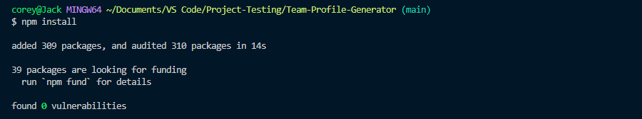

# TEAM PROFILE GENERATOR

# Description

This is a Node.js application. It takes information via command line input and builds a webpage displaying the team members of a project. 

# Table of Contents

* [Installation](#installation)
* [Usage](#usage)
* [Contribute](#contribute)
* [Questions](#questions)

# Installation

## Clone the repository to your local machine

## Make sure [Node.js](https://nodejs.org/en/download/) is downloaded and installed 
## Open a terminal, navigate to the cloned directory, and open it with your source-code editor

## Type the command 'npm install' to install all project dependencies

## Run the program by typing 'node index.js' and completing the prompt

## Video Walkthrough:

https://www.youtube.com/watch?v=4tjXAcsa4Zc&ab_channel=Weelz

# Usage

## Follow instructions from the installation section and/or the video walkthrough

## Once all prompts are answered, a webpage and style sheet will populate the '/dist' folder
## This webpage now outlines each team member inputted

## Enjoy! Use this for whatever project it is meant for..

# Contribute

If you wish to contribute to this project, follow these steps:

- Fork the repository
- Clone or download to your local machine
- Make any changes/updates and push to your remote fork
- Start a pull request

# Questions

Created by: [CWheelsRun](https://github.com/CWheelsRun)
  
If you have any further questions please feel free to contact me at [corey.bennett@live.com](corey.bennett@live.com)